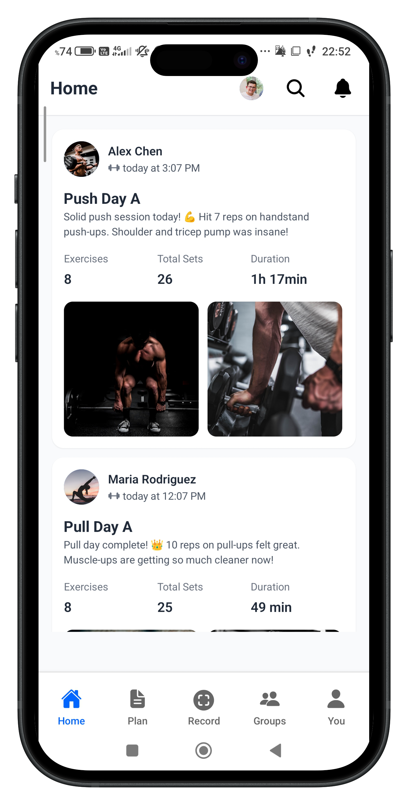
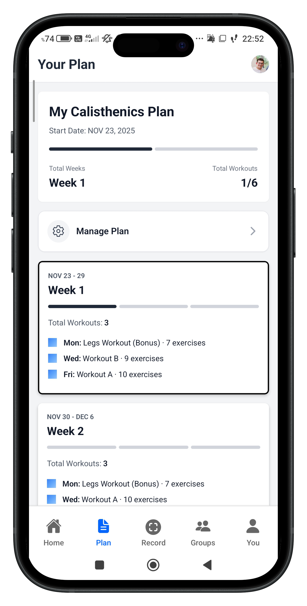

  
  
  # Calos 💪
  
  **Your Fitness Journey Starts Here**
  
  A comprehensive fitness tracking app that helps you plan, record, and analyze your workouts with AI-powered insights and social features.
  
  
  
  

---

## 📖 About Calos

Calos is a modern, cross-platform fitness application designed for fitness enthusiasts and calisthenics athletes who want to take their training to the next level. Whether you're a beginner starting your fitness journey or an advanced athlete looking to optimize your training, Calos provides the tools you need to succeed.

With AI-powered workout generation, intelligent plan analysis, and a supportive social community, Calos makes it easy to stay consistent, track progress, and achieve your fitness goals.

---

## ✨ Key Features

### 🤖 AI-Powered Workout Plans

Generate personalized workout plans tailored to your fitness level, goals, and schedule using Google Gemini AI. Input your current abilities, available training days, and target areas, and let AI create a comprehensive program designed specifically for you.

### 📄 PDF Plan Analysis

Already have a workout plan in PDF format? Upload it and let our AI analyze and structure it into an actionable, trackable format. Perfect for following programs from coaches, books, or online resources.

### 🎥 Smart Workout Recording

Record your workouts with advanced features including:

- Video recording for form analysis
- Built-in timers and rest countdown
- Exercise-by-exercise tracking
- Real-time performance logging
- Manual or video-based workout entry

### 📊 Progress Tracking

Visualize your fitness journey with comprehensive analytics:

- Performance charts and statistics
- Workout history and trends
- Personal records tracking
- Weekly and monthly progress summaries

### 👥 Social Features

Connect with a community of fitness enthusiasts:

- Follow other users and view their workouts
- Share your workout achievements
- Activity feed with followed users' workouts
- Profile sharing via QR codes
- Public/private profile options

### 📅 Intelligent Plan Management

Create and manage workout plans with flexibility:

- Recurring (cyclic) or fixed-duration plans
- Weekly schedule customization
- Rest day scheduling
- Multi-week progression tracking
- Active plan monitoring

### 🏆 Achievement System

Stay motivated with gamification features:

- Track personal records (PRs)
- Unlock achievements
- Milestone celebrations
- Progress badges

### 🔗 Profile & Sharing

Showcase your fitness journey:

- Customizable user profiles
- Workout media gallery (photos/videos)
- Social stats (followers, following, workouts)
- QR code profile sharing
- Public workout showcase

---

## 📱 Screenshots

  
### Home Feed

_Stay motivated by following your friends and viewing their workout achievements in your personalized feed_

### Workout Plans

_Manage your workout plans with weekly schedules and track your progress throughout the program_

### Record Workouts

_Track your workouts day-by-day with an intuitive calendar view and start recording with a single tap_

---

## 🛠️ Technology Stack

### Frontend & Mobile Framework

- **Expo** - Cross-platform development framework
- **React Native** - Native mobile application framework
- **React** - UI library for building user interfaces
- **TypeScript** - Static type checking for reliability and developer experience
- **Expo Router** - File-based navigation system

### Styling & User Interface

- **NativeWind** - Tailwind CSS for React Native
- **TailwindCSS** - Utility-first CSS framework
- **React Native Reanimated** - High-performance animation library
- **React Native Gesture Handler** - Touch and gesture management
- **Expo Linear Gradient** - Gradient styling components

### Backend & Database

- **Supabase** - For the Backend
  - PostgreSQL database for structured data
  - Real-time subscriptions
  - Row Level Security (RLS) for data protection
  - Authentication and user management
  - File storage for media content
  - Edge Functions for serverless computing

### AI & Machine Learning

- **Google Generative AI** - Gemini 2.5 Flash model
  - Personalized workout plan generation
  - PDF workout plan analysis
  - Intelligent exercise recommendations

### Analytics & Monitoring

- **PostHog** - Product analytics and user behavior tracking

### Media & Visualization

- **React Native Chart Kit** - Data visualization and charts
- **React Native SVG** - Vector graphics rendering
- **React Native QR Code SVG** - QR code generation
- **Expo Image** - Optimized image handling
- **Expo AV** - Audio and video playback
- **Expo Image Picker** - Camera and gallery access
- **React Native Compressor** - Media compression for long videos

### Utilities & Tools

- **date-fns** - Modern date utility library
- **AsyncStorage** - Local data persistence
- **React Native Countdown Circle Timer** - Timer components

---

## 🏗️ App Architecture

Calos is built with a modern, scalable architecture:

### Multi-Platform Support

- **iOS**: Native iOS application via Expo
- **Android**: Native Android application via Expo

### Navigation & Routing

- File-based routing using Expo Router
- Tab-based navigation for main features (Home, Plan, Record, You)
- Stack navigation for detailed views
- Deep linking support

### Authentication & Security

- Supabase Authentication with email/password
- Row Level Security (RLS) policies for data protection
- Secure session management with AsyncStorage
- User privacy controls (public/private profiles)

### Data Management

- PostgreSQL database via Supabase
- Real-time data synchronization
- Optimistic UI updates
- Offline-first considerations with local caching

### AI Processing

- Server-side AI processing via Supabase Edge Functions
- Structured prompt engineering for consistent results
- PDF parsing and content extraction
- Context-aware workout recommendations

### Media Handling

- Video recording and playback
- Image compression and optimization
- Supabase Storage for media files
- Secure CDN delivery

---

## 🎯 Core Functionality

### Workout Plan Types

#### AI-Generated Plans

- Multi-step form for user information (age, fitness level, goals)
- Personalized exercise selection based on current abilities
- Progressive overload scheduling
- Customizable training frequency and focus areas
- Support for calisthenics and specific exercise mastery

#### PDF Upload Plans

- Upload workout PDFs from any source
- AI extracts exercises, sets, reps, and schedules
- Structured plan creation with weekly breakdowns
- Custom AI instructions for specific analysis needs

#### Manual Entry

- Create workouts on-the-fly
- Video or manual exercise entry
- Flexible exercise logging
- Quick workout recording

### Social Networking

#### Following System

- Follow/unfollow other users
- View followers and following lists
- Profile privacy controls (public/private)

#### Activity Feed

- Real-time feed of followed users' workouts
- Workout details with media
- Engagement features
- Infinite scroll with pagination

#### Profile Features

- User profiles with stats and achievements
- Media gallery (photos/videos from workouts)
- QR code sharing for easy profile discovery
- Social statistics (followers, following, total workouts)

### Progress Analytics

#### Performance Metrics

- Workout volume tracking
- Exercise progression over time
- Personal records (PRs) by exercise
- Training frequency analysis

#### Visualizations

- Chart-based progress displays
- Weekly and monthly summaries
- Goal tracking and completion rates

---

## 🌐 Platform Compatibility

| Platform | Support Level   | Notes        |
| -------- | --------------- | ------------ |
| iOS      | ✅ Full Support | iOS 13.0+    |
| Android  | ✅ Full Support | Android 5.0+ |

---

## 💡 Design Philosophy

Calos is built with the following principles:

- **User-Centric**: Intuitive interfaces that make fitness tracking effortless
- **AI-Enhanced**: Intelligent features that adapt to individual needs
- **Community-Driven**: Social features that foster motivation and accountability
- **Cross-Platform**: Consistent experience across all devices
- **Privacy-Focused**: User control over data sharing and visibility
- **Performance-First**: Smooth animations and responsive interactions

---

## 📄 License

This project is private and proprietary.

---

## 📧 Contact & Support

For questions, feedback, or support, please reach out through the app's settings or contact the development team.

---

  
**Built with ❤️ using Expo, React Native, and Supabase**

